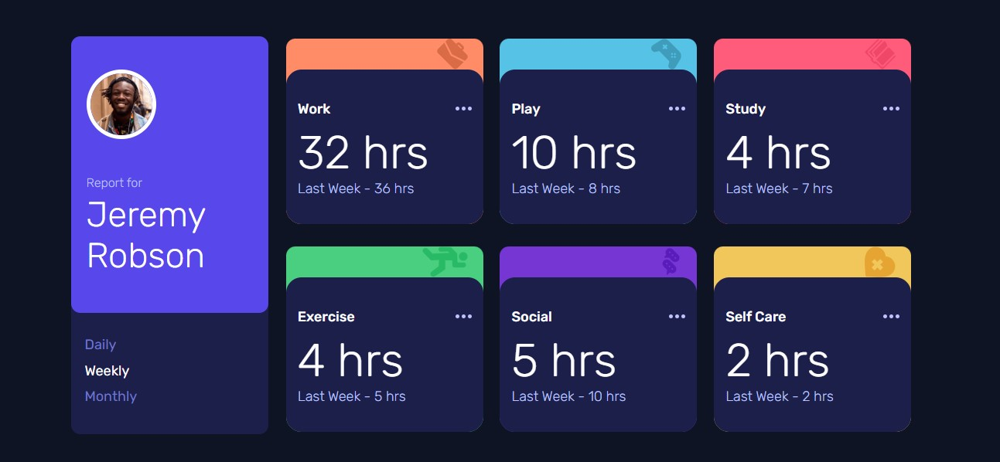

# Frontend Mentor - Time tracking dashboard solution

This is a solution to the [Time tracking dashboard challenge on Frontend Mentor](https://www.frontendmentor.io/challenges/time-tracking-dashboard-UIQ7167Jw). Frontend Mentor challenges help you improve your coding skills by building realistic projects. 

## Table of contents

- [Overview](#overview)
  - [The challenge](#the-challenge)
  - [Screenshot](#screenshot)
  - [Links](#links)
- [My process](#my-process)
  - [Built with](#built-with)
  - [Continued development](#continued-development)
- [Author](#author)

## Overview

### The challenge

Users should be able to:

- View the optimal layout for the site depending on their device's screen size
- See hover states for all interactive elements on the page
- Switch between viewing Daily, Weekly, and Monthly stats

### Screenshot

### Links

- Solution URL: [github.com/MachadoA/time-tracking-app](https://github.com/MachadoA/time-tracking-app)
- Live Site URL: [Ana Amaral](https://anaamaral.netlify.app/)

## My process

### Built with

- Flexbox
- CSS Grid
- Mobile-first workflow
- [React](https://reactjs.org/) - JS library

### Continued development

I worked with the concepts of flex display and column grid. In this project, I also consolidated my knowledge in state management using useContext

## Author

- Website - [Ana Amaral](https://anaamaral.netlify.app/)
- Frontend Mentor - [@MachadoA](https://www.frontendmentor.io/profile/MachadoA)

